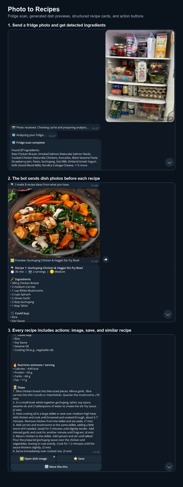
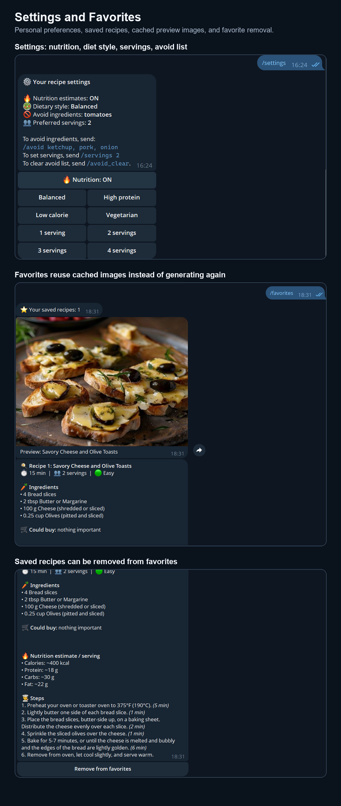
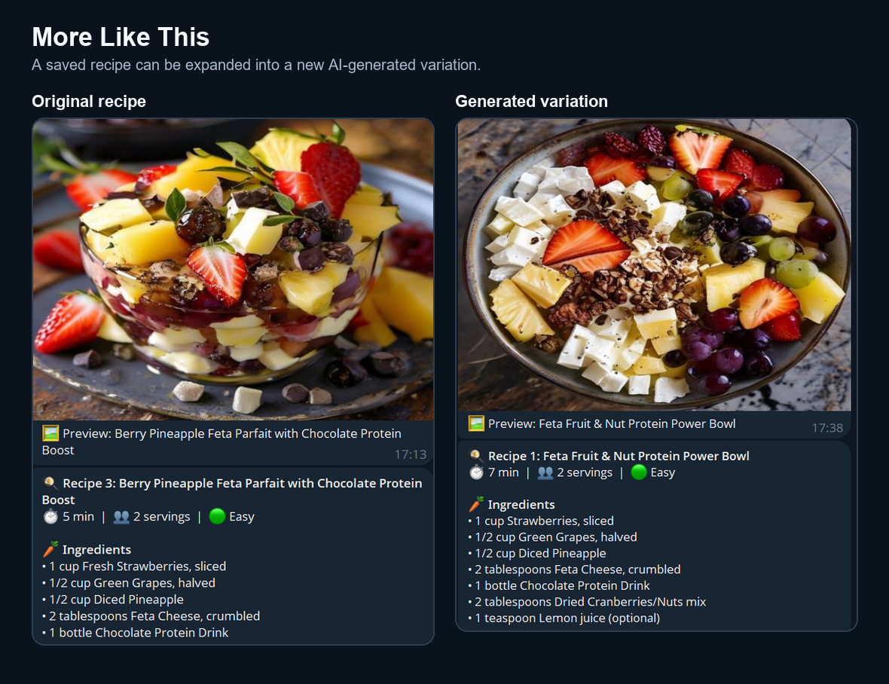

# AI Photo Recipe

AI Photo Recipe is a Telegram bot that turns a fridge photo into practical recipe ideas. A user sends a photo, the bot detects visible ingredients with Gemini Vision, generates structured recipes, creates dish previews, and lets the user save recipes, request variations, or tune personal food preferences.

It combines async Telegram UX, multimodal AI, strict Pydantic outputs, PostgreSQL persistence, Redis caching, Playwright scraping, pandas analytics, Docker, and CI.

## Demo

### Photo to recipes



### Personalization and favorites



### More like this



## Features

- Fridge photo analysis: send a Telegram photo and get detected ingredients plus 3 recipe ideas.
- Structured AI output: recipes are validated with Pydantic before they are shown to the user.
- Dish image previews: Pollinations.ai generates food previews before each recipe card.
- Image cache: generated dish images are cached in Redis and reused in `/favorites`.
- Photo cache: repeated fridge photos are cached by SHA-256 hash, with user preferences included in the cache variant.
- Personal settings: `/settings` supports nutrition estimates, servings, and diet style.
- Diet styles: balanced, high protein, low calorie, and vegetarian.
- Avoid list: `/avoid ketchup, pork, onion` prevents those ingredients from being used in recipes.
- Favorites: users can save recipes, view them later, and remove them from favorites.
- More like this: generates a new similar recipe from a saved/result recipe using Gemini, with OpenRouter as fallback.
- Recipe URL normalization: send a recipe page URL and Playwright extracts page text, then an LLM normalizes it into the same recipe schema.
- Analytics: `/stats` uses pandas to show total recipes, photo vs URL split, cache hits, and top ingredients.
- Rate limiting: Redis-backed limit for photo messages.
- Optional FastAPI API: exposes `/health`, `/api/analyze-photo`, and `/api/normalize-url`.

## Tech Stack

| Area | Tools |
| --- | --- |
| Telegram bot | aiogram 3.x |
| Vision and recipe generation | Gemini API |
| LLM fallback / URL normalization | OpenRouter via OpenAI-compatible client |
| Image previews | Pollinations.ai |
| Scraping | Playwright |
| Validation | Pydantic v2 |
| Database | PostgreSQL, SQLAlchemy async, Alembic |
| Cache and limits | Redis |
| Analytics | pandas |
| API | FastAPI, Uvicorn |
| DevOps | Docker Compose, GitHub Actions CI, pytest, ruff |

## Architecture

```text
Telegram user
  -> aiogram handlers
  -> Gemini Vision / OpenRouter / Playwright
  -> Pydantic RecipeBatch validation
  -> PostgreSQL recipe history and favorites
  -> Redis photo cache, image cache, rate limits
  -> Telegram recipe cards, previews, buttons
```

Key modules:

- `src/recipe/bot/handlers/photo.py` handles fridge photos, cache checks, retries, and recipe delivery.
- `src/recipe/vision/analyzer.py` calls Gemini Vision and validates the recipe JSON.
- `src/recipe/bot/presentation.py` formats Telegram recipe cards and manages dish preview caching.
- `src/recipe/bot/handlers/settings.py` manages nutrition, diet style, servings, and avoid list.
- `src/recipe/bot/handlers/favorites.py` handles save, remove, cached favorite previews, and similar recipes.
- `src/recipe/scraper/playwright_scraper.py` extracts recipe pages with Playwright.
- `src/recipe/analytics/stats.py` builds `/stats` with pandas.
- `src/recipe/api/main.py` exposes the optional FastAPI interface.

## Quick Start

Create `.env` from the example:

```bash
cp .env.example .env
```

Fill the required keys:

```env
BOT_TOKEN=...
GEMINI_API_KEY=...
OPENROUTER_API_KEY=...
```

Run the bot with Docker Compose:

```bash
docker compose up --build
```

The default Compose setup starts:

- `bot`: Telegram polling bot
- `db`: PostgreSQL
- `redis`: cache and rate limit store
- `migrate`: Alembic migrations

Open Telegram and send `/start`, then send a fridge photo.

## Optional API

The bot is the main product. FastAPI is included as an optional developer interface for testing the same backend without Telegram.

Start it with:

```bash
docker compose --profile api up --build api
```

Then open:

```text
http://localhost:8001/docs
```

Available endpoints:

- `GET /health`
- `POST /api/analyze-photo`
- `POST /api/normalize-url`

## Telegram Commands

| Command | Purpose |
| --- | --- |
| `/start` | Start bot and show the main menu |
| `/help` | Explain how to use the bot |
| `/settings` | Open nutrition, style, servings, and avoid-list controls |
| `/avoid ketchup, pork` | Add ingredients the bot should not use |
| `/avoid_clear` | Clear the avoid list |
| `/servings 2` | Set preferred servings |
| `/favorites` | Show saved recipes with cached images and remove buttons |
| `/stats` | Show recipe history analytics |

## Local Development

Install the package with development dependencies:

```bash
pip install -e ".[dev]"
```

Install Playwright browsers:

```bash
playwright install chromium
```

Run tests and linting:

```bash
ruff check src tests
pytest --tb=short
```

Run the bot locally:

```bash
python -m recipe.bot.main
```

Run the optional API locally:

```bash
uvicorn recipe.api.main:app --reload
```

## Deployment

There are two practical ways to run the project:

1. **Local Docker setup** - use `docker compose up --build` to run the bot, PostgreSQL, Redis, and migrations on your machine.
2. **Server setup without Docker** - run the bot as a normal Python process and use managed PostgreSQL/Redis services.

A typical server setup looks like this:

- **Bot worker**: Python venv on the server running `python -m recipe.bot.main` under `nohup` or a systemd-user unit; aiogram polls Telegram directly, no public port required.
- **PostgreSQL**: an external managed service (Neon, Supabase, or any hosted Postgres); point `DATABASE_URL` at it.
- **Redis**: an external managed service (Upstash); point `REDIS_URL` at the `rediss://` TLS endpoint.

The application code is identical across local and server environments. SQLAlchemy and `redis-py` read endpoints from `DATABASE_URL` / `REDIS_URL`, so switching from docker-compose service names (`db:5432`, `redis:6379`) to managed endpoints requires only environment variable changes.

Run migrations on the production database before the first start:

```bash
alembic upgrade head
```

## Environment Variables

| Variable | Description |
| --- | --- |
| `BOT_TOKEN` | Telegram bot token from BotFather |
| `GEMINI_API_KEY` | Gemini key for photo analysis and similar recipes |
| `GEMINI_MODEL` | Gemini model, for example `gemini-2.5-flash` |
| `OPENROUTER_API_KEY` | OpenRouter key for URL normalization and fallback LLM work |
| `OPENROUTER_MODEL` | OpenRouter model, for example a free instruct model |
| `OPENROUTER_VISION_MODEL` | OpenRouter fallback model for fridge photo analysis, for example `openrouter/free` |
| `OPENROUTER_BASE_URL` | OpenRouter OpenAI-compatible base URL |
| `DATABASE_URL` | Async SQLAlchemy PostgreSQL URL |
| `REDIS_URL` | Redis URL |
| `RATE_LIMIT_PHOTOS_PER_HOUR` | Photo rate limit per Telegram user |
| `CACHE_TTL_SECONDS` | Fridge photo analysis cache TTL |
| `IMAGE_CACHE_TTL_SECONDS` | Dish preview image cache TTL |

## What It Demonstrates

- multimodal AI integration with real user photos;
- strict JSON validation instead of trusting raw LLM text;
- resilient UX with retries, cache hits, and graceful fallbacks;
- async Telegram bot architecture with middleware;
- user personalization that changes actual model behavior;
- persistent user data with PostgreSQL and Alembic migrations;
- Redis caching for both expensive photo analysis and generated images;
- real web scraping with Playwright;
- analytics with pandas;
- optional API surface for backend testing;
- Dockerized infrastructure and automated CI checks.

## Current Status

The main Telegram bot flow is complete and ready to demo:

- photo analysis works;
- settings affect generated recipes;
- favorites can be saved and removed;
- dish photos are generated and cached;
- similar recipes use Gemini first and OpenRouter as fallback;
- URL normalization, stats, Docker, migrations, tests, and CI are included.
